# Morphogen

**An engine of emergent pattern formation for the web.** Two families of models, eighteen named
patterns, nine color ramps, one classic script with no dependencies and no build step for the page
that uses it, the simulation on the graphics processor with the processor as fallback, and full
keyboard, touch and screen-reader operation.

[**Live demo**](https://cs-training-systems.github.io/morphogen/) ·
[Quick start](#quick-start) · [Families and patterns](#families-and-patterns) · [Controls](#controls) ·
[API](#api) · [Palettes](#palettes) · [How it is built](#how-it-is-built) · [Accessibility](#accessibility) ·
[Forking and contributing](#forking-and-contributing) · [Citing](#citing-and-attribution) · [License](#license)

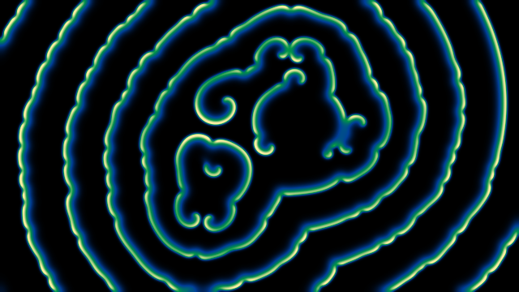

## What it is

Morphogen runs models of self-organization on a canvas, in the page, at the finest grid the visitor's
machine can animate without dropping frames, and shows the result through one visual language: a
four-color ramp over a smooth field, with every front leaving a trail that fades down the ramp. The
word is Alan Turing's, for the chemicals he proposed in 1952 as the agents of living form; read as
*morphogenesis*, the generation of form, it names the whole engine.

The models are written from their published equations and rules, each cited in the source beside its
code, with no borrowed code. They fall into two families, chosen so that every pattern in a family
rests on the same kind of mathematics:

- **Reaction–diffusion** — continuous fields on a plane, local kinetics plus diffusion. Gray–Scott in
  eight regimes, and the phase-field dendrite of Kobayashi (a reaction–diffusion system in form).
- **Cellular automata** — discrete states on a lattice, updated by local rules. A snow crystal, Lenia,
  cyclic rotors, dielectric breakdown, falling sand, Rule 30, the forest fire, Potts grains, and a
  lattice-Boltzmann fluid.

## Quick start

Copy `morphogen.js` and `morphogen.css` into your site and write:

```html
<link rel="stylesheet" href="morphogen.css">
<div data-rd-scope>
  <canvas data-morphogen data-preset="malachite" data-palette="canopy"
          role="img" aria-label="An emergent-pattern simulation. Click and drag on it to seed a pattern."></canvas>
</div>
<script src="morphogen.js" defer></script>
```

That is the whole integration: one stylesheet, one canvas, one script tag. The script defines a
single global, `Morphogen`, mounts every `canvas[data-morphogen]` when the document is ready, and
binds any controls you place inside the same `[data-rd-scope]` container by their `data-rd` role
(next sections). `index.html` in this repository is the full control set; copy what you need.

As a dependency, pinned to a release:

```
npm install github:cs-training-systems/morphogen#v2.0.0-beta.1
```

This is a pre-release of 2.0: the engine and all eighteen patterns are in place and their calibration
continues; see [CHANGELOG.md](CHANGELOG.md). The last stable release is 1.0.2:

```
npm install github:cs-training-systems/morphogen#v1.0.2
```

The package ships the script and the stylesheet only. Serve them from your own origin; nothing is
fetched at run time, and the script makes no network request of any kind.

### Canvas attributes

| Attribute | Meaning | Default |
|---|---|---|
| `data-preset` | a preset id (see [Families and patterns](#families-and-patterns)); sets the model, its parameters and its seeding | `malachite` |
| `data-model` · `data-feed` · `data-kill` | a model id with parameter overrides, for a canvas without a preset | Gray–Scott 0.010 · 0.035 |
| `data-palette` | a palette id (see [Palettes](#palettes)) | `canopy` |
| `data-time-scale` | speed; steps per frame = 8 × this | 0.75 |
| `data-step-scale` | a further multiplier on the steps per frame (a preset may slow itself) | 1 |
| `data-dscale` | Gray–Scott diffusion scale: both diffusion rates multiplied (sets the spacing between fronts) | 1 |
| `data-hover` | `on`: the pointer paints on hover alone; otherwise only while a button is held | off |
| `data-quality` | the resolution: a ladder width (240 … 1600 cells across) or `auto` (up to the display, adaptive) | `320` |
| `data-gpu` | `off` to force the processor path | on |
| `data-brush` | the pointer's mark as a share of the field's height | 0.03 |
| `data-fade-start` · `data-fade-end` | seconds after the pointer leaves at which a Gray–Scott pattern winds down and dies; unset = never | unset |

## Families and patterns

A **preset** is a model, its parameter values, its seeding, its speed, its brush and its palette, all
chosen so the pattern shows at its best; the two parameter sliders are centered on the preset's values.
A **family** is the set of presets whose mathematics is one kind; the demo's family row swaps the
tile set. A tile selects: the field clears to black and nothing appears until the visitor paints or
presses Seed, which starts the pattern at the center (later presses add one point at random).

### Reaction–diffusion

| Preset | Model | Parameters | Looks like |
|---|---|---|---|
| 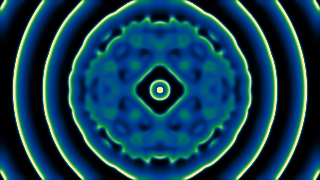 **Malachite** | Gray–Scott | feed 0.008 · kill 0.031 | concentric banded fronts from a pacemaker (target patterns) |
| 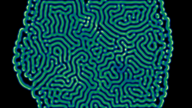 **Meandric** | Gray–Scott | 0.024 · 0.054 | labyrinthine stripes (a Turing pattern) |
| 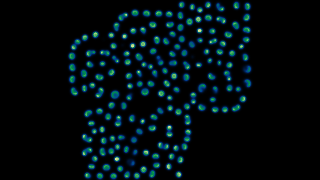 **Swarm** | Gray–Scott | 0.013 · 0.054 | a crowd of travelling, dividing spots |
| 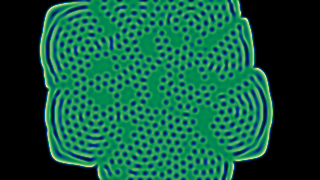 **Xylem** | Gray–Scott | 0.039 · 0.058 | a sheet opening into a pore lattice |
| 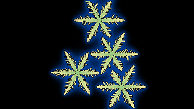 **Frost** | phase-field dendrite | supercooling 0.40 · anisotropy 0.05 | a six-fold dendrite, faceted, side-branching, a random orientation at every reset |
| 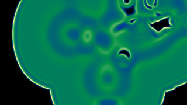 **Turbulence** | Gray–Scott | 0.025 · 0.050 | spatiotemporal chaos that never settles |
| 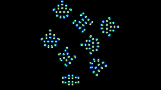 **Mitosis** | Gray–Scott | 0.036 · 0.065 (240 rung) | self-replicating spots, close, forming colonies |
| 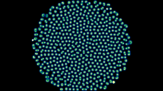 **Phyllotaxis** | Gray–Scott | 0.030 · 0.062 | a sunflower head grown one spot at a time on the golden angle, to the frame's edge |
| 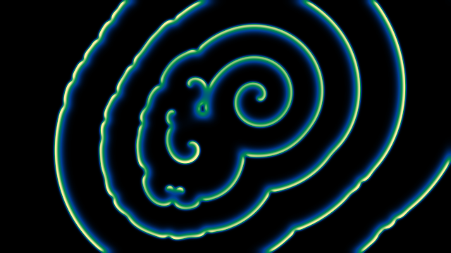 **Vortex** | Gray–Scott | 0.008 · 0.039, diffusion × 3.2 | spiral waves from broken fronts; every Seed press and click fires a stir of five points and four curved slashes |

**Gray–Scott** (Gray & Scott 1984; Pearson 1993), per step, with the 3×3 Laplacian (center −1,
edges 0.2, corners 0.05) and dt = 1:

```
U' = U + (Du·∇²U − U·V² + f·(1 − U))      Du = 0.2097
V' = V + (Dv·∇²V + U·V² − (f + k)·V)      Dv = 0.105
```

**The phase-field dendrite** (Kobayashi 1993, in the form documented by Warren et al. and NIST's
FiPy): an order parameter φ (0 melt, 1 solid) and the undercooling ΔT on a grid of spacing 0.025,
`τ ∂φ/∂t = ∇·(D ∇φ) + φ(1 − φ)(φ − ½ − (κ₁/π) atan(κ₂ ΔT))`, `∂ΔT/∂t = D_T ∇²ΔT + ∂φ/∂t`, with
the anisotropic tensor D = α²[[1 + c cos 6ψ, 6c sin 6ψ], [−6c sin 6ψ, 1 + c cos 6ψ]], ψ the
interface direction plus the crystal's orientation, and a small noise on the reaction for
side-branching (α 0.015, τ 3·10⁻⁴, κ₁ 0.9, κ₂ 20, D_T 2.25). Stepped explicitly at the stable time
step, in conservative staggered form, on the canvas's own pixels.

### Cellular automata

| Preset | Model | Parameters | Looks like |
|---|---|---|---|
|  **Frost** | Gravner–Griffeath snow crystal (2008) | vapor 0.65 · anisotropy 1.75 | a hexagonal plate growing six arms, on a hexagonal lattice that follows the Resolution rung |
| 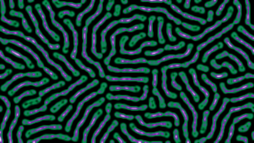 **Lenia** | Chan 2019 | growth center 0.15 · width 0.016 | smooth, self-propelling creatures from a patch of soup |
|  **Rotor** | cyclic automaton (Griffeath) | 8 states · threshold 2 | spiral rotors self-organizing from noise |
|  **Lichtenberg** | dielectric breakdown (Niemeyer–Pietronero–Wiesmann 1984) | exponent 2.1 · rate 1.3 | lightning and Lichtenberg figures; exponent 1 is diffusion-limited aggregation |
| 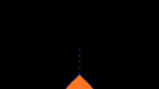 **Sandpile** | falling sand (Toffoli–Margolus 1987) | grains 4 · slip 0.7 | a drop point pours sand that heaps at the angle of repose and avalanches |
| 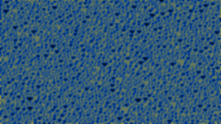 **Conus** | elementary automaton (Wolfram) | rule 30 · density 0 | the cone-snail shell, rows laid down in time |
|  **Wildfire** | forest fire (Drossel–Schwabl 1992) | growth 0.005 · lightning 0.00002 | fractal fire fronts through a self-organizing forest |
|  **Grain** | Potts grain growth (Anderson et al. 1984) | 12 orientations · temperature 0.6 | polycrystalline coarsening, a moving micrograph |
|  **Wake** | lattice-Boltzmann fluid (D2Q9, BGK) | flow 0.115 · viscosity 0.005 | a von Kármán vortex street behind an obstacle you paint |

Each automaton's rule is stated in the demo's note for its tile, with its law in MathML, and in the
comment at the head of its source file.

The snow crystal is not a reaction–diffusion system — it has no local chemistry acting everywhere,
only transport and a sharp interface that advances where mass arrives, a discrete Stefan problem kin
to diffusion-limited aggregation — which is why it lives in this family while the phase-field
dendrite, its smooth-interface cousin, lives in the other. Reiter's simpler snow rule (2005) remains in
the registry as the model `reiter`.

## Controls

Any element inside the `[data-rd-scope]` container with one of these roles is wired automatically.
All of them are optional.

| `data-rd` | Element | What it does |
|---|---|---|
| `family` | `<button data-rd-id="rd|ca">` | Shows that family's tiles and selects its default tile; `aria-pressed` tracks the active one; `data-rd-default` marks the initial family |
| `preset` | `<button data-rd-id="…">`, optionally holding a `thumb` canvas | Selects a preset and clears the field (nothing is seeded until the visitor paints or presses Seed); `aria-pressed` tracks the active one; `data-rd-default` marks a family's initial tile |
| `thumb` | `<canvas aria-hidden="true">` inside a preset button | Filled with a thumbnail of that preset, computed by the engine itself after the page has loaded; repainted when the colors change |
| `note` | any element with `data-rd-for="<preset id>"` | Shown while that preset is active, hidden otherwise |
| `feed-range` / `feed-number` | `<input type="range">` / `<input type="number">` | The preset's first parameter; the pair tracks itself; its label, range and step follow the preset |
| `kill-range` / `kill-number` | as above | The second parameter |
| `scale-range` / `scale-number` | as above | Speed, on a logarithmic slider centered on the preset's speed (a fifth to five times it) |
| `pause` | `<button>` | Pause / Play; its text and label follow the state |
| `reset` | `<button>` | Clears the field to the ground color |
| `seed` | `<button>` | Starts the pattern at the center; later presses place one random point (a preset may run its own opening on every press) |
| `colors-toggle` · `colors-menu` | `<button aria-expanded aria-controls>` · `<fieldset>` | A drop-down of `palette-option` radios; a choice, Escape, or focus leaving closes it |
| `palette-option` | `<input type="radio" value="<palette id>" data-rd-name="…">` | Color ramp by id |
| `motion-check` · `motion` | `<input type="checkbox">` · `<button aria-pressed>` | The accessibility toggle, reduced motion on or off (see [Accessibility](#accessibility)) |
| `hover-check` · `hover` | `<input type="checkbox">` · `<button aria-pressed>` | Hover mode: the pointer paints on hover alone; off (the default) it paints only while a button is held, and a touch always paints |
| `mode` | any element | Receives "FAMILY: PATTERN" in capitals |
| `loading` | any element with `hidden` | Shown while a reduced-motion still is computed |
| `quality` | `<select>` | The resolution: a ladder width (240 … 1600) or `auto`; see [Resolution](#how-it-is-built) |
| `brush` | `<select>` | Brush width: the pointer's mark as a share of the field's height |
| `measure` | any element | Receives the lattice in use, the frame rate and the brush, twice a second |
| `state` | any element | Receives a visible one-line state: family, pattern, colors, animating / paused / reduced motion |
| `status` | any element with `aria-live="polite"` | Receives a short plain-text status on every change |
| `steps` | `<select>` | Base steps per frame |

## API

```js
const field = Morphogen.mount(canvas, options);   // or Morphogen.get(canvas) after auto-mount
field.setModel("gray-scott", { feed: 0.029, kill: 0.057 });   // any model in Morphogen.models, with parameter overrides
field.setParams(0.029, 0.057).setTimeScale(1).setPalette("aurora");   // the two user parameters, by position
field.setParam("kappa2", 10);                                // any parameter by key, the model's extras included
field.setDiffusionScale(3.2);                                // Gray–Scott: both diffusion rates × 3.2 (Vortex uses this)
field.setHover(true);                                        // paint on hover alone; false (default) = click and drag
field.seedSpec({ type: "spiral", n: 21, r: 3 });            // "spiral" | "strokes" | "discs" | "grow" | "pacemaker" | "center" | "fill" | "stir"
field.setFirstMark(spec, every);                             // the seeding the first mark runs (every: on every Seed press and click)
field.pause(); field.play(); field.clear();
field.on((type, f) => { /* "model" "params" "palette" "pause" "play" "clear" "seed" "quiet" "quality" "motion" "hover" */ });
field.quality();                                             // { auto, cap, level, width, height, lattice, grid, radius, ms, fps, steps, backend }
field.setQuality(640); field.setQuality("auto");             // a ladder width, or adaptive up to the display
field.setReducedMotion(true);                                // the chronogram still (see Accessibility)
field.tick();                                                // one frame of work, no scheduling (tests)
field.engine();                                              // the backend (diagnostics)
field.destroy();
```

`Morphogen.models`, `Morphogen.families`, `Morphogen.presets` and `Morphogen.palettes` expose the
built-in sets; `Morphogen.defineModel(definition)` registers a model (see `src/`);
`Morphogen.renderThumb(preset, { width, height, steps }, useGpu)` renders a preset offline.
`ReactionDiffusion` is kept as an alias of the global for pages written against 1.x.

## Palettes

Each ramp is four colors: the ground (black, so a decaying edge fades into it), a trail, a body and a
front, mapped over the field's display scalar. The names are one word, scientific, and the colors are
the brand set.

| Id | Colors |
|---|---|
| `canopy` (default) | black · deep blue `#003E99` · green `#009149` · buff `#FEEEA3` |
| `aurora` | black · green `#009149` · violet `#7728A8` · white |
| `spectrum` | black · deep blue `#003E99` · red `#D30011` · white |
| `neon` | black · red `#D30011` · green `#009149` · white |
| `accretion` | black · deep blue `#003E99` · orange `#FD5F00` · white |
| `physarum` | black · deep blue `#003E99` · yellow `#FDD100` · white |
| `cherenkov` | black · violet `#7728A8` · cyan `#0095DA` · white |
| `orodruin` | black · red `#D30011` · orange `#FD5F00` · yellow `#FDD100` |
| `coastal` | black · deep blue `#003E99` · cyan `#0095DA` · buff `#FEEEA3` |

Your own ramp: `field.setPalette(["#000000", "#102040", "#2080c0", "#ffffff"])`.

## How it is built

**One mathematics per model, two engines.** On WebGL2 with float render targets (every current
desktop and mobile browser) every model runs on the graphics processor: one fragment-shader pass per
step and pass, over a ping-pong pair of float textures (one to three textures per state, for models
with up to twelve numbers per cell), seeding and resampling as passes too. Otherwise, and in Node for
the tests and the media renderer, the processor path runs the identical update on typed arrays. A
model declares both steps, written from the same rule.

**The model registry.** A model is a plain object: its family, its lattice (square or hexagonal),
its state channels, its two user parameters with names and ranges, its fixed extras, its passes, its
seeding, its display mapping, its liveness test, its glow and its resolution policy. The core knows
no model. `src/` holds one file per model or group; `tools/build.js` concatenates them into the
shipped script.

**The glow stage.** Every model's display scalar, before the palette, passes through a small
Gaussian blur and a persistence field that each frame takes the maximum of the blurred scalar and its
own decayed self. The reaction–diffusion field is smooth and lingering by nature; the glow gives the
automata the same language, so edges are never seen and every moving front leaves a trail that fades
down the ramp. Each model sets its blur and decay.

**Resolution.** The ladder runs 240 … 1600 cells across; the height follows the frame's own aspect
ratio. A model declares how it uses it:
- *ladder* — the grid is the chosen rung, and on Automatic the engine adapts beneath the display:
  from 400 wide, it climbs while its own compute time stays under 8 ms and frames arrive on time,
  steps down above 12 ms or when frames arrive late, holds a second after each change, and
  resamples the running state so a change is invisible. The field is a continuum (Gray–Scott, Lenia,
  the fluid) or a lattice whose blur follows the cell (the snow crystal), so a coarse rung shows
  large smooth features, never cells.
- *pixels* — the lattice is the canvas's own device pixels (capped at 2048 across), so every
  structure is at full actual resolution; the rung has no effect, which the measure line says.

**Seeding and speed.** A preset's seeding is geometry in the field's own pixels: Vogel's spiral,
strokes, discs, a growing head placed one spot every few frames on the golden angle until it leaves
the frame, a pacemaker that fires again and again, the whole field, or a timed stir of points and
curved slashes. Time scale 1 is 8 steps per frame; the default 0.75 is 6; a preset may slow itself
(`stepScale`) and set its own speed, on which the slider is centered.

**Fade window.** Off by default: patterns run until Reset. With `fadeStart`/`fadeEnd` set, a
Gray–Scott pattern's autocatalytic gain winds down smoothly between those times after the pointer
leaves. `npm test` runs `tests/verify-fade.js`, which proves this per preset in Node with an
injected clock.

**Thumbnails** are computed by the engine itself after the page has loaded, on the graphics processor
through an offscreen canvas (milliseconds each, no main-thread cost), their display scalars kept so a
palette change repaints them.

## Accessibility

- The canvas is `role="img"` with a text alternative; the pointer interaction is decorative, so
  everything is operable without a pointer: families, presets, Seed, Pause and Reset are real
  buttons; the parameters and speed are native range and number inputs with labels.
- Painting needs a held button by default, so an unintended pass of the pointer changes nothing;
  Hover mode is an opt-in toggle. A touch always paints while the finger is on the field, and the
  field never takes the whole width of a phone, so a thumb beside it still scrolls the page.
- **Photosensitivity.** Some regimes flicker and pulse. The demo carries a notice before the field,
  and Reduced motion replaces the animation with a still; a host page should carry the same notice
  in reading order before the field.
- Every change is announced through a polite live region; state is never conveyed by color alone
  (the active family, preset and color are marked by border and mark).
- **Reduced motion** is an accessibility mode, for people for whom moving content causes
  vestibular symptoms, and it starts on when the operating system asks for it
  (`prefers-reduced-motion: reduce`); the page can also expose it as a toggle. By design it replaces
  the animation with one still frame that is substantially equivalent to the animation for the
  current settings: a chronogram whose left edge is the seed state, whose right edge is the pattern
  at full development, and whose middle is the transition, recomputed for any change of pattern,
  parameters or colors. The color menu's animation is removed under the same preference.
- A visible state line always says which family, pattern and colors are engaged and whether the
  field is animating, paused or in reduced motion, and the active pattern's note sits beneath it.
- The frame, corner brackets, thumbnails and swatches keep their borders under Windows high
  contrast (`forced-colors: active`).

## Browser support

Any current browser. The graphics-processor path needs WebGL2 with the `EXT_color_buffer_float`
extension, which every current desktop and mobile browser provides; without it the processor path
takes over with the same mathematics at a coarser grid. Everything else is Canvas 2D,
`requestAnimationFrame`, pointer events, `matchMedia` and typed arrays. The demo's notes use inline
MathML, which every current browser renders natively.

## Forking and contributing

Fork on GitHub, clone your fork, and open `index.html` from any local web server; there is nothing
to install. Edit `src/`, run `node tools/build.js`, run `npm test`. See
[CONTRIBUTING.md](CONTRIBUTING.md) for the conventions that keep the project small, and
[CHANGELOG.md](CHANGELOG.md) for what changed when.

## Citing and attribution

Morphogen is MIT-licensed, so you may use, copy, modify and redistribute it, including
commercially, provided the copyright and license notice stay with it. If you show it or build on
it, a credit line is appreciated:

> Morphogen, © 2026 Christopher A. Stamplis, MIT License — https://github.com/cs-training-systems/morphogen

For publications, use GitHub's **Cite this repository** button (the metadata is in
[CITATION.cff](CITATION.cff)) and cite the model's sources, which are listed there and at the head of
each model's source file: Gray & Scott (1984) and Pearson (1993) for Gray–Scott; Kobayashi (1993) for
the dendrite; Gravner & Griffeath (2008) and Reiter (2005) for the snow crystals; Chan (2019) for
Lenia; Fisch, Gravner & Griffeath (1991) for the cyclic automaton; Niemeyer, Pietronero & Wiesmann
(1984) for dielectric breakdown; Toffoli & Margolus (1987) for falling sand; Wolfram (1983) for the
elementary automaton; Drossel & Schwabl (1992) for the forest fire; Anderson, Srolovitz, Grest & Sahni
(1984) for grain growth; Qian, d'Humières & Lallemand (1992) for the lattice-Boltzmann method.

Morphogen is written from the published equations and rules with no borrowed code. Visual
inspiration: [pmneila/jsexp](https://github.com/pmneila/jsexp) (BSD-3-Clause).

## License

MIT © 2026 Christopher A. Stamplis. The full terms are in [LICENSE](LICENSE).
