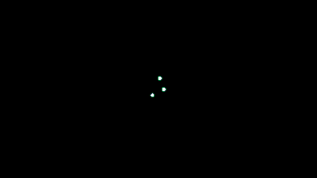
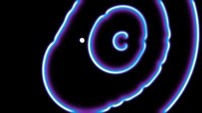
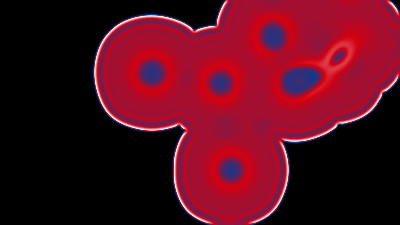
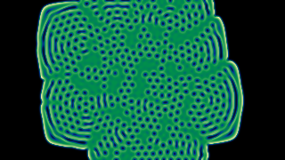

# Morphogen

**A Gray–Scott reaction–diffusion field for the web.** One classic script, no dependencies, no
build step. Click and drag on the field and a pattern grows; nine named regimes, seven color
ramps, the simulation on the graphics processor with adaptive resolution, and full keyboard and
screen-reader operation.

[**Live demo**](https://cs-training-systems.github.io/morphogen/) ·
[Quick start](#quick-start) · [Controls](#controls) · [API](#api) · [Presets](#presets) ·
[Palettes](#palettes) · [Calibration](#calibration) · [Accessibility](#accessibility) ·
[Forking and contributing](#forking-and-contributing) · [Citing](#citing-and-attribution) ·
[License](#license)


| A drag stroke seeds the field | A head grows on the golden angle | Spiral waves | Spatiotemporal chaos |
|---|---|---|---|
|  |  |  |  |

## What it is

Morphogen simulates the Gray–Scott model, a two-chemical reaction–diffusion system in which a
substance *V* makes more of itself from a substance *U* while both diffuse. Alan Turing proposed
in 1952 that chemistry of this kind could lay down the patterns of living form; he called the
chemicals *morphogens*. Depending on two numbers, the feed rate *f* and the kill rate *k*, the same
equations produce spots, stripes, labyrinths, spiral waves, dividing cells and chaos. Morphogen
runs the equations on a canvas, in the page, at the finest grid the visitor's machine can animate
without dropping frames.

The model, per step, with the 3×3 Laplacian (center −1, edges 0.2, corners 0.05) and dt = 1:

```
U' = U + (Du·∇²U − U·V² + f·(1 − U))·dt      Du = 0.2097
V' = V + (Dv·∇²V + U·V² − (f + k)·V)·dt      Dv = 0.105
```

## Quick start

Copy `reaction-diffusion.js` and `reaction-diffusion.css` into your site and write:

```html
<link rel="stylesheet" href="reaction-diffusion.css">
<div data-rd-scope>
  <canvas data-reaction-diffusion data-feed="0.010" data-kill="0.035" data-palette="canopy"
          role="img" aria-label="A reaction–diffusion simulation. Click and drag on it to seed a pattern."></canvas>
</div>
<script src="reaction-diffusion.js" defer></script>
```

That is the whole integration: one stylesheet, one canvas, one script tag. The script defines a
single global, `ReactionDiffusion`, mounts every `canvas[data-reaction-diffusion]` when the
document is ready, and binds any controls you place inside the same `[data-rd-scope]` container by
their `data-rd` role (next section). `index.html` in this repository is the full control set; copy
what you need.

As a dependency, pinned to a release:

```
npm install github:cs-training-systems/morphogen#v1.0.1
```

The package ships the script and the stylesheet only. Serve them from your own origin; nothing is
fetched at run time, and the script makes no network request of any kind.

### Canvas attributes

| Attribute | Meaning | Default |
|---|---|---|
| `data-feed` · `data-kill` | the Gray–Scott rates | 0.010 · 0.035 |
| `data-palette` | a palette id (see [Palettes](#palettes)) | `canopy` |
| `data-time-scale` | speed, 0.5 … 2.5; steps per frame = 8 × this | 0.75 |
| `data-dscale` | diffusion scale: both diffusion rates multiplied; sets the spacing between fronts (a preset may carry its own) | 1 |
| `data-hover` | `on`: the pointer paints on hover alone; otherwise only while a button is held | off |
| `data-steps` | base steps per frame | 8 |
| `data-quality` | the resolution ceiling: `auto` (up to the display) or a ladder index 0–8 (320 … 1600 cells wide); the engine adapts beneath it | `auto` |
| `data-gpu` | `off` to force the processor path | on |
| `data-brush` | the pointer's mark as a share of the field's height | 0.03 |
| `data-fade-start` · `data-fade-end` | seconds after the pointer leaves at which the chemistry winds down and dies; unset = never | unset |

## Controls

Any element inside the `[data-rd-scope]` container with one of these roles is wired automatically.
All of them are optional.

| `data-rd` | Element | What it does |
|---|---|---|
| `preset` | `<button data-rd-id="…">`, optionally holding a `thumb` canvas | Selects a named regime and clears the field (nothing is seeded until the visitor paints or presses Seed); `aria-pressed` tracks the active one; `data-rd-default` marks the initial one |
| `thumb` | `<canvas aria-hidden="true">` inside a preset button | Filled with a live-rendered thumbnail of that regime; repainted when the colors change |
| `note` | any element with `data-rd-for="<preset id>"` | Shown while that preset is active, hidden otherwise |
| `feed-range` / `feed-number` | `<input type="range">` / `<input type="number">` | Feed rate; the pair tracks itself |
| `kill-range` / `kill-number` | as above | Kill rate |
| `scale-range` / `scale-number` | as above | Speed (the time scale) |
| `pause` | `<button>` | Pause / Play; its text and label follow the state |
| `reset` | `<button>` | Clears the field to the ground color |
| `seed` | `<button>` | Seeds one point: the first at the center, later ones at random, until Reset or a new pattern |
| `colors-toggle` · `colors-menu` | `<button aria-expanded aria-controls>` · `<fieldset>` | A drop-down of `palette-option` radios; a choice, Escape, or focus leaving closes it |
| `palette-option` | `<input type="radio" value="<palette id>" data-rd-name="…">` | Color ramp by id |
| `motion` · `motion-check` | `<button aria-pressed>` · `<input type="checkbox">` | The accessibility toggle, reduced motion on or off; either control toggles and both stay in step (see [Accessibility](#accessibility)) |
| `hover` · `hover-check` | `<button aria-pressed>` · `<input type="checkbox">` | Hover mode: the pointer paints on hover alone; off (the default) it paints only while a button is held |
| `mode` | any element | Receives the current pattern's name in capitals |
| `loading` | any element with `hidden` | Shown while a reduced-motion still is computed |
| `quality` | `<select>` | The resolution ceiling: `auto` or a ladder index; plain numbers in the demo |
| `brush` | `<select>` | Brush width: the pointer's mark as a share of the field's height (0.02 … 0.20; default 0.03) |
| `measure` | any element | Receives the grid in use, the frame rate and the engine in use, twice a second |
| `state` | any element | Receives a visible one-line state: pattern, colors, animating / paused / reduced motion |
| `status` | any element with `aria-live="polite"` | Receives a short plain-text status on every change |
| `steps` | `<select>` | Base steps per frame |

## API

```js
const field = ReactionDiffusion.mount(canvas, options);   // or ReactionDiffusion.get(canvas) after auto-mount
field.setParams(0.029, 0.057).setTimeScale(1).setPalette("aurora");
field.setDiffusionScale(3.2);                                // both diffusion rates × 3.2 (Vortex uses this)
field.setHover(true);                                        // paint on hover alone; false (default) = click and drag
field.seedSpec({ type: "spiral", n: 21, r: 3 });            // "spiral" | "strokes" | "discs" | "grow"
field.pause(); field.play(); field.clear();
field.on((type, f) => { /* "params" "palette" "pause" "play" "clear" "seed" "quiet" "quality" "motion" */ });
field.quality();                                             // { cap, level, width, height, ms, fps, steps, backend: "gpu" | "cpu" }
field.setQuality("auto"); field.setQuality(5);               // the resolution ceiling; the engine adapts beneath it
field.setReducedMotion(true);                                // the chronogram still (see Accessibility)
field.tick();                                                // one frame of work, no scheduling (tests)
field.destroy();
```

`ReactionDiffusion.presets` and `ReactionDiffusion.palettes` expose the built-in sets;
`ReactionDiffusion.renderThumb(preset, { width, height, steps })` renders a regime offline.

## Presets

Each preset is a `(feed, kill)` pair with a seeding that shows the regime at its best. The names
are plain descriptors; the demo's notes give the technical term and the simplest law behind each.

| Preset | feed / kill | Looks like |
|---|---|---|
|  **Malachite** | 0.010 / 0.035 | concentric banded fronts (target patterns) |
|  **Meandric** | 0.029 / 0.057 | labyrinthine stripes (a Turing pattern) |
|  **Swarm** | 0.014 / 0.054 | a crowd of travelling, dividing spots |
|  **Honeycomb** | 0.039 / 0.058 | a sheet opening into a pore lattice |
|  **Frost** | 0.037 / 0.060, six-fold anisotropy | a hexagonal crystal grown from one point: the activator diffuses faster along six directions, three fields turned ±15° shown together |
|  **Turbulence** | 0.026 / 0.051 | spatiotemporal chaos that never settles |
|  **Mitosis** | 0.037 / 0.065 | self-replicating spots |
|  **Phyllotaxis** | 0.030 / 0.062 | a sunflower head built on the golden angle, one spot at a time |
|  **Vortex** | 0.014 / 0.047, diffusion × 3.2 | spiral waves from broken strokes |

Seeding specs: `spiral` places *n* discs on Vogel's phyllotaxis spiral (angle 137.5°, radius ∝ √n);
`grow` does the same one disc every few frames; `strokes` lays short line segments whose free ends
spin up spiral waves; `discs` scatters *n* discs.

## Palettes

Each ramp is four colors: the ground (black, so a decaying edge fades into it), a trail, a body
and a front, mapped over the concentration of *V*.

| Id | Colors |
|---|---|
| `canopy` (default) | black · deep blue `#003E99` · green `#009149` · buff `#FEEEA3` |
| `aurora` | black · green `#009149` · violet `#7728A8` · white |
| `spectrum` | black · deep blue `#003E99` · red `#D30011` · white |
| `neon` | black · red `#D30011` · green `#009149` · white |
| `accretion` | black · deep blue `#003E99` · orange `#FD5F00` · white |
| `physarum` | black · deep blue `#003E99` · yellow `#FDD100` · white |
| `cherenkov` | black · violet `#7728A8` · cyan `#0095DA` · white |

Your own ramp: `field.setPalette(["#000000", "#102040", "#2080c0", "#ffffff"])`.

## Calibration

### Front end (what a page author sets)

- **Rates and ranges.** The sliders in `index.html` span feed 0.008–0.070 and kill 0.030–0.066, the
  band where Pearson's named regimes live; outside it the field is mostly blank or uniformly filled.
- **Time scale.** 1 is 8 steps per frame; the default 0.75 is 6. Cost is linear in time scale, and
  the automatic resolution absorbs it by changing rung.
- **Grid shape.** The simulation grid always takes the frame's own aspect ratio, measured on
  screen, so a square frame gets a square grid and nothing is stretched. Give the frame its shape
  in CSS (`aspect-ratio`); the engine follows, and re-follows on resize.
- **Thumbnails** render at 96×54 for 300 steps after the page has loaded, one per idle slot, so
  the page never blocks; change `thumb` in the mount options to trade detail for time.
- **Diffusion scale.** A preset may multiply both diffusion rates (`dscale`). The regime (the
  feed/kill pair) is unchanged; the wavelength grows with the square root of the scale, so fronts
  sit further apart. Vortex uses 3.2, which reproduces the effective rate of a 5-point Laplacian at
  a 0.8 time step, the numerics pmneila/jsexp's "Waves" preset runs on.

### Back end (what the engine decides, and how to re-tune it)

- **Two engines, one mathematics.** On WebGL2 with float render targets (every current desktop
  and mobile browser) the simulation runs on the graphics processor: one fragment-shader pass per
  step over a ping-pong pair of float textures, the palette applied in a final pass, seeding and
  resampling as passes too. Otherwise, and in Node for the tests and the media renderer, the
  processor path runs the identical update on typed arrays. Force the processor path with
  `data-gpu="off"` or `gpu: false`.
- **Adaptive resolution beneath a ceiling.** The resolution control sets the most cells allowed
  across the field (plain numbers in the demo; `auto` means up to the display). Beneath that, from
  400 wide, the engine climbs the ladder (320 … 1600) while its own compute time stays under
  `budgetMs` (8 ms) and frames arrive on time; it steps down above `ceilingMs` (12 ms), when two
  of the last thirty frames exceed 16 ms, or when frames arrive late (the graphics processor's own
  limit); any change of a setting re-evaluates at once; it holds one second after each change;
  and it resamples the running state bilinearly, so a change is invisible. Re-tune by passing
  `budgetMs` / `ceilingMs` to `mount`.
- **Fade window.** Off by default: patterns run until Reset. With `fadeStart`/`fadeEnd` set, the
  autocatalytic gain winds down smoothly between those times after the pointer leaves, and every
  regime starves at about the same moment. `npm test` runs `tests/verify-fade.js`, which proves
  this per preset in Node with an injected clock.
- **Anisotropy.** A preset may carry `aniso: { eps, fold, phases }`: the activator's diffusion
  becomes direction-dependent, D(θ) = D (1 + ε cos(fold·(θ − phase))), applied as a flux through
  each cell face with θ the gradient direction at that face; one copy of the field runs per phase
  and the maximum is shown. Frost uses ε 0.6, six-fold, phases −15°/0°/+15°. On the graphics
  processor that is three step passes per frame; the processor path's adaptive resolution absorbs it.
- **Adding a preset.** Add `{ id, name, feed, kill, seed }` (optionally `dscale`, `aniso`, `thumbSteps`) to `PRESETS`, a button and a note to
  `index.html`, run `npm test`, and render its still with `node tools/render-media.js`.

## Accessibility

- The canvas is `role="img"` with a text alternative; the pointer interaction is decorative, so
  everything is operable without a pointer: presets, Seed, Pause and Reset are real buttons; feed,
  kill and speed are native range and number inputs with labels.
- Painting needs a held button by default, so an unintended pass of the pointer changes nothing;
  Hover mode is an opt-in toggle. Nothing moves until the visitor acts.
- **Photosensitivity.** Some regimes flicker and pulse. The demo carries a notice, and Reduced
  motion replaces the animation with a still; a host page should carry the same notice in reading
  order before the field (the demo's `instructions` paragraph is one place for it).
- Every change is announced through a polite live region; state is never conveyed by color alone
  (the active preset and color are marked by border and mark).
- **Reduced motion** is an accessibility mode, for people for whom moving content causes
  vestibular symptoms, and it starts on when the operating system asks for it
  (`prefers-reduced-motion: reduce`); the page can also expose it as a toggle (`data-rd="motion"`).
  By design it replaces the animation with one still frame that is substantially equivalent to the
  animation for the current settings: a chronogram whose left edge is the seed state, whose right
  edge is the regime at full development, and whose middle is the transition, recomputed for any
  change of pattern, rates or colors. The color menu's animation is removed under the same
  preference.
- A visible state line (`data-rd="state"`) always says which pattern and colors are engaged and
  whether the field is animating, paused or in reduced motion, and the active pattern's note sits
  beneath it, so the tool's mode is never ambiguous.
- The frame, corner brackets, thumbnails and swatches keep their borders under Windows high
  contrast (`forced-colors: active`).
- Vertical touch swipes over the field scroll the page (`touch-action: pan-y`); only sideways
  motion while touching paints.

## Browser support

Any current browser. The graphics-processor path needs WebGL2 with the `EXT_color_buffer_float`
extension, which every current desktop and mobile browser provides; without it the processor path
takes over with the same mathematics. Everything else is Canvas 2D, `requestAnimationFrame`,
pointer events, `matchMedia` and typed arrays. The demo's notes use inline MathML, which every
current browser renders natively.

## Forking and contributing

Fork on GitHub, clone your fork, and open `index.html` from any local web server; there is nothing
to install. `npm test` runs the fade verifier. See [CONTRIBUTING.md](CONTRIBUTING.md) for the
conventions that keep the project small, and [CHANGELOG.md](CHANGELOG.md) for what changed when.

## Citing and attribution

Morphogen is MIT-licensed, so you may use, copy, modify and redistribute it, including
commercially, provided the copyright and licence notice stay with it. If you show it or build on
it, a credit line is appreciated:

> Morphogen, © 2026 Christopher A. Stamplis, MIT License — https://github.com/cs-training-systems/morphogen

For publications, use GitHub's **Cite this repository** button (the metadata is in
[CITATION.cff](CITATION.cff)), and cite the model's sources:

- P. Gray and S. K. Scott, "Autocatalytic reactions in the isothermal, continuous stirred tank
  reactor", *Chemical Engineering Science* 39 (1984).
- J. E. Pearson, "Complex patterns in a simple system", *Science* 261 (1993).

Morphogen is written from the published equations with no borrowed code. Visual inspiration:
[pmneila/jsexp](https://github.com/pmneila/jsexp) (BSD-3-Clause).

## License

MIT © 2026 Christopher A. Stamplis. The full terms are in [LICENSE](LICENSE).
